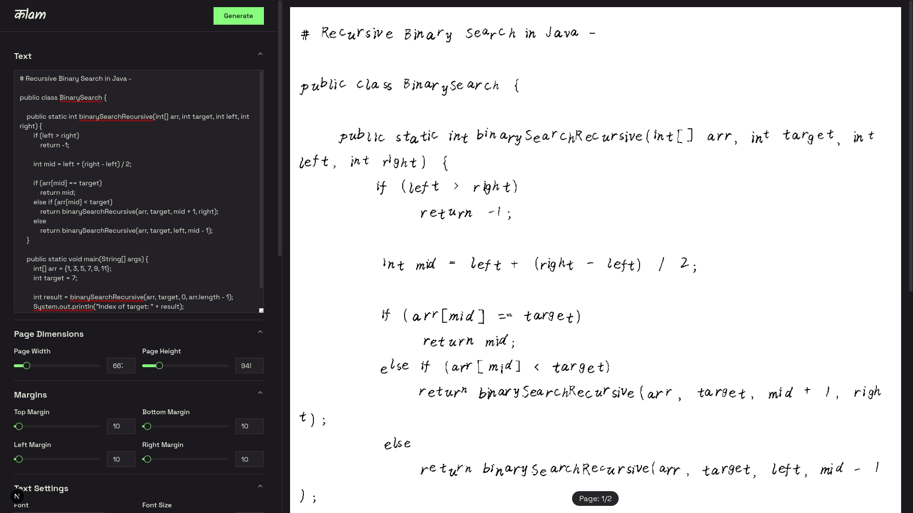

<h1 align="center">
कlam - Handwriting Generator
</h1>

<p align="center"> 


/
</p>

कlam is a powerful handwriting generation tool that allows you to convert digital text into realistic-looking handwritten documents. Perfect for adding a personal touch to digital content or quickly generating handwritten assignments.



## ✨ Features

- 🖌️ **Multiple Font Styles**: Choose from a variety of handwriting fonts
- 📄 **Custom Paper Settings**: Adjust paper dimensions to match your needs
- 🎨 **Appearance Customization**: Control font size, line spacing, and margins
- 🔀 **Natural Randomization**: Apply subtle variations to create realistic handwriting
- 🎭 **Color Options**: Customize text and background colors
- 📱 **Responsive UI**: Works on both desktop and mobile devices
- 🚀 **Fast Processing**: Quick generation of handwritten text

## 🏗️ Project Structure

The project consists of two main components:

- **Frontend**: A Next.js web application providing a user-friendly interface
- **Backend**: A FastAPI service that handles the handwriting generation

```
कlam/
├── frontend/         # Next.js web application
└── backend/          # FastAPI backend service
    ├── core.py       # Handwriting generation core logic
    ├── main.py       # API endpoints
    ├── tools.py      # Utility functions
    └── ttf_library/  # Handwriting font files
```

## 🚀 Getting Started

### Prerequisites

- Python 3.12 or newer
- Node.js 18 or newer
- npm, yarn, or pnpm

### Backend Setup

1. Navigate to the backend directory:

   ```
   cd backend
   ```

2. Create a virtual environment and activate it:

   ```
   python -m venv venv
   source venv/bin/activate  # On Windows: venv\Scripts\activate
   ```

3. Install dependencies:

   ```
   pip install -e .
   ```

4. Start the backend server:

   ```
   uvicorn main:app --reload
   ```

   The API will be available at `http://localhost:8000`

### Frontend Setup

1. Navigate to the frontend directory:

   ```
   cd frontend
   ```

2. Install dependencies:

   ```
   npm install
   # or
   yarn
   # or
   pnpm install
   ```

3. Start the development server:

   ```
   npm run dev
   # or
   yarn dev
   # or
   pnpm dev
   ```

4. Open [http://localhost:3000](http://localhost:3000) to access the application.

## 🔧 API Endpoints

The backend API provides the following endpoints:

- `GET /api/v1/fonts` - List all available fonts
- `POST /api/v1/generate` - Generate handwritten text with specified parameters

For detailed API documentation, see the [API Specification](./backend/docs/api_specification.md).

## 🧩 How It Works

कlam uses the [Handright](https://github.com/Gsllchb/Handright) library to render text with natural-looking handwriting effects. The generation process includes:

1. Text input processing
2. Font and style selection
3. Parameter application (size, spacing, perturbations)
4. Image rendering with randomized variations
5. Output formatting and delivery

The result is a realistic simulation of handwritten text that maintains legibility while introducing the natural variations found in real handwriting.

## 🤝 Contributing

Contributions are welcome! Please feel free to submit a Pull Request.

1. Fork the repository
2. Create your feature branch: `git checkout -b feat/amazing-feature`
3. Commit your changes: `git commit -m 'feat: add some amazing feature'`
4. Push to the branch: `git push origin feat/amazing-feature`
5. Open a Pull Request

## 📄 License

This project is licensed under the MIT License - see the [LICENSE](./LICENSE.md) file for details.

## 🙏 Acknowledgements

- [Handright](https://github.com/Gsllchb/Handright) - The core handwriting generation library
- [FastAPI](https://fastapi.tiangolo.com/) - The backend framework
- [Next.js](https://nextjs.org/) - The frontend framework
- [Shadcn UI](https://ui.shadcn.com/) - UI components used in the frontend
